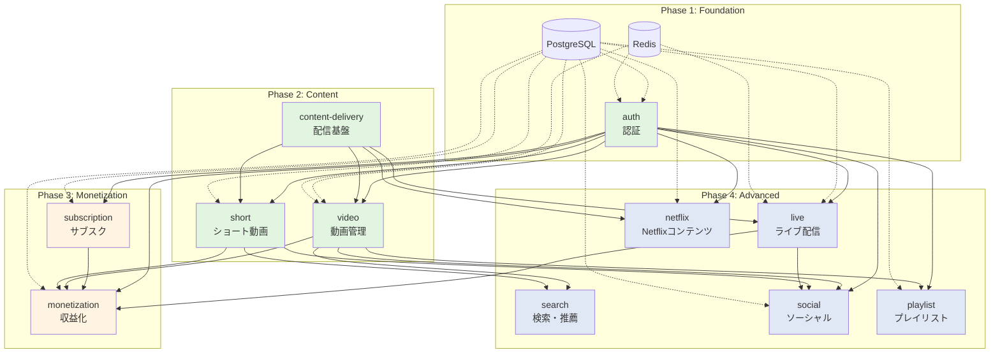

# 実装計画書（概要）

## 1. エグゼクティブサマリー

### 1.1 プロジェクト目標

動画配信プラットフォームのバックエンドAPIを段階的に構築し、以下の目標を達成する:

**Phase 1（MVP）- 初期16週間:**
- **基本的な動画配信**: 1万ユーザー、1,000同時接続に対応
- **コアコンテンツ**: 通常動画、基本的なユーザー管理
- **基礎収益化**: サブスクリプション（Stripe統合）
- **MVP品質**: API応答 < 500ms、動画開始 < 3秒、99% SLA
- **テストカバレッジ**: 単体テスト70%以上、コアエンドポイント統合テスト

**Phase 2（拡張）- 追加12-16週間:**
- ショート動画、ライブ配信機能
- 高度な収益化（CCBill統合、投げ銭）
- Elasticsearch検索・推薦システム
- スケーリング改善（10,000同時接続対応）

**Phase 3（エンタープライズ）- 追加8-12週間:**
- Netflix風コンテンツ管理
- パフォーマンス最適化（API < 200ms、動画 < 2秒）
- 99.9% SLA達成
- 100,000同時接続スケーリング

**重要**: 各フェーズ完了時に実稼働可能な状態を維持します。

### 1.2 スコープ

#### 開発対象（In Scope）

✅ **認証・認可システム**
- JWT ベースの認証（アクセス + リフレッシュトークン）
- メール確認、パスワードリセット
- セッション管理

✅ **サブスクリプション管理**
- 3プラン対応（Free、Premium ¥980/月、Premium+ ¥1,980/月）
- Stripe + CCBill 決済統合
- プラン変更、キャンセル、webhook 処理

✅ **コンテンツ配信基盤**
- S3 アップロード（presigned URL）
- AWS MediaConvert トランスコード（HLS, 4解像度）
- CloudFront CDN 配信（署名付きURL）

✅ **動画管理**
- CRUD、タグ、カテゴリ、プライバシー設定
- いいね、コメント、視聴履歴
- バージョン管理

✅ **ショート動画管理**
- 最大60秒の縦型動画
- スワイプ型UI向けAPI
- いいね、コメント

✅ **ライブ配信**
- RTMP Ingest（OBS対応）
- HLS出力、リアルタイムチャット
- スーパーチャット（投げ銭）
- アーカイブ保存

✅ **収益化機能**
- 投げ銭（Stripe + CCBill）
- クリエイター収益管理
- 出金申請、税務情報

✅ **ソーシャル機能**
- フォロー、通知、アクティビティフィード
- ユーザー統計、通知設定

✅ **プレイリスト**
- 作成、編集、公開設定
- 動画追加・並べ替え

✅ **Netflix風コンテンツ**
- 映画・TVシリーズ管理
- シーズン・エピソード構造
- IP権利管理

✅ **検索・推薦**
- Elasticsearch 全文検索
- おすすめアルゴリズム
- トレンド分析

✅ **チャンネル作成**
- クリエイタープロフィール
- チャンネル設定、ブランディング

#### 開発対象外（Out of Scope）

❌ フロントエンド開発（既に完成）
❌ モバイルアプリ開発（既に完成）
❌ 動画編集機能
❌ コミュニティ投稿機能
❌ メンバーシップ制度
❌ ストーリー機能
❌ ショッピング機能

### 1.3 タイムライン概要

**総開発期間（MVP）**: 約16週間（4ヶ月）

| フェーズ | 期間 | 主要マイルストーン |
|---------|-----|------------------|
| Phase 1: Foundation | 3週間 | 認証、DB、CI/CD完成、動画アップロード基礎 |
| Phase 2: Core Features | 5週間 | 動画CRUD、基本的なサブスク（Stripe）、CDN配信 |
| Phase 3: Social & Discovery | 4週間 | いいね・コメント、基本検索、プレイリスト |
| Phase 4: Monetization Polish | 2週間 | 収益管理、支払い処理、出金機能 |
| Phase 5: Production Readiness | 2週間 | 本番環境構築、負荷テスト（1,000同時接続）、モニタリング |

**Phase 2以降（拡張機能）**: 追加12-20週間
- ショート動画、ライブ配信、Netflix風コンテンツ
- Elasticsearch検索・推薦
- CCBill統合、高度な収益化

**リスクバッファ**: 各フェーズに20%の予備期間を設定

### 1.4 チームサイズ想定

**推奨チーム構成**:
- **バックエンドエンジニア**: 2-3名
- **DevOpsエンジニア**: 1名
- **QAエンジニア**: 1名
- **合計**: 4-5名

**最小チーム構成**（スタートアップ向け）:
- **フルスタックエンジニア**: 2名
- 合計: 2名（期間は1.5倍に延長）

### 1.5 成功基準

#### 機能要件

- ✅ 全14機能の実装完了
- ✅ 全APIエンドポイントが正常動作
- ✅ Stripe + CCBill 決済フロー完動

#### 非機能要件

- ✅ API応答時間 < 200ms（P95）
- ✅ 動画開始時間 < 2秒
- ✅ 同時接続 10,000ユーザー対応
- ✅ データベースクエリ < 100ms

#### 品質要件

- ✅ 単体テストカバレッジ > 80%
- ✅ 統合テスト全エンドポイント
- ✅ E2Eテスト主要フロー（認証、決済、動画アップロード）
- ✅ セキュリティ監査パス

#### 運用要件

- ✅ CI/CD パイプライン稼働
- ✅ 監視・ロギング設定完了
- ✅ エラーアラート設定完了
- ✅ 99.9% SLA達成

---

## 2. 開発フェーズ詳細

### Phase 1: Foundation（基盤構築）

**期間**: 2週間
**ゴール**: バックエンドの土台となる認証、DB、インフラを完成させる

#### 主要成果物

1. **プロジェクト初期化**
   - Node.js + TypeScript + Fastify プロジェクト作成
   - ESLint、Prettier、Husky 設定
   - ディレクトリ構造構築（レイヤードアーキテクチャ）

2. **データベースセットアップ**
   - PostgreSQL スキーマ設計（Prisma）
   - マイグレーション作成
   - シードデータ投入

3. **認証システム**
   - ユーザー登録、ログイン、ログアウト
   - JWT 発行（アクセス + リフレッシュトークン）
   - メール確認フロー
   - パスワードリセットフロー

4. **インフラ基盤**
   - Redis セットアップ（セッション管理）
   - AWS S3 バケット作成
   - CI/CD パイプライン（GitHub Actions）

#### 依存関係

- なし（最初のフェーズ）

#### 退出基準

- ✅ ユーザーが登録・ログインできる
- ✅ JWT トークンが正常に発行される
- ✅ メール確認が機能する
- ✅ パスワードリセットが機能する
- ✅ 単体テスト + 統合テスト パス
- ✅ CI/CD パイプラインで自動テスト実行

---

### Phase 2: Content Management（コンテンツ管理）

**期間**: 4週間
**ゴール**: 動画・ショート動画のアップロード、トランスコード、再生機能を完成させる

#### 主要成果物

1. **コンテンツ配信基盤**
   - S3 presigned URL 発行
   - AWS MediaConvert トランスコード連携
   - CloudFront CDN 配信
   - 署名付きURL 生成

2. **動画管理**
   - 動画CRUD（作成、取得、更新、削除）
   - タグ、カテゴリ管理
   - プライバシー設定（public/unlisted/private）
   - アダルトフラグ

3. **動画再生**
   - HLS ストリーミング
   - 視聴履歴保存
   - 進捗管理（途中再生）
   - 視聴回数カウント

4. **動画インタラクション**
   - いいね機能
   - コメント機能（返信対応）
   - コメントいいね

5. **ショート動画管理**
   - ショートCRUD（最大60秒制限）
   - スワイプ型フィード API
   - いいね、コメント

#### 依存関係

- Phase 1 完了（認証必須）

#### 退出基準

- ✅ 動画アップロード → トランスコード → CDN配信 が動作
- ✅ HLS 再生が正常動作
- ✅ いいね、コメントが正常動作
- ✅ ショート動画が縦型で再生可能
- ✅ 全エンドポイントのテストパス

---

### Phase 3: Monetization（収益化）

**期間**: 3週間
**ゴール**: サブスクリプション、決済、収益管理を完成させる

#### 主要成果物

1. **サブスクリプション管理**
   - 3プラン定義（Free、Premium、Premium+）
   - プラン切り替え
   - キャンセル、再開

2. **Stripe 統合**
   - Checkout Session 作成
   - Webhook 処理（checkout.session.completed 等）
   - 決済履歴管理
   - カード情報管理

3. **CCBill 統合**
   - Checkout URL 生成
   - Webhook 処理
   - アダルトコンテンツ年齢確認

4. **投げ銭機能**
   - 動画・ショート・ライブへの投げ銭
   - Stripe + CCBill 決済

5. **クリエイター収益**
   - 収益記録
   - 出金申請
   - 税務情報管理

#### 依存関係

- Phase 1 完了（認証必須）
- Stripe + CCBill アカウント作成

#### 退出基準

- ✅ ユーザーがPremiumプランに課金できる
- ✅ Stripeのwebhookが正常処理される
- ✅ CCBillでアダルトコンテンツ決済ができる
- ✅ 投げ銭が機能する
- ✅ クリエイターが出金申請できる

---

### Phase 4: Advanced Features（高度な機能）

**期間**: 5週間
**ゴール**: ライブ配信、検索、推薦、Netflix風コンテンツを完成させる

#### 主要成果物

1. **ライブ配信**
   - ライブ作成、開始、終了
   - RTMP Ingest（MediaLive）
   - HLS 出力
   - リアルタイムチャット（WebSocket）
   - スーパーチャット
   - アーカイブ保存

2. **検索・推薦**
   - Elasticsearch セットアップ
   - 全文検索（タイトル、説明、タグ）
   - おすすめ動画アルゴリズム
   - トレンド分析

3. **ソーシャル機能**
   - フォロー・フォロワー
   - 通知システム
   - アクティビティフィード
   - 通知設定

4. **プレイリスト**
   - プレイリストCRUD
   - 動画追加・削除・並び替え
   - 公開設定

5. **Netflix風コンテンツ**
   - 映画・TVシリーズ管理
   - シーズン・エピソード
   - IP権利管理
   - 視聴履歴

6. **チャンネル作成**
   - クリエイタープロフィール
   - チャンネル設定
   - 統計情報

#### 依存関係

- Phase 2 完了（動画管理必須）
- Phase 3 完了（収益化必須）

#### 退出基準

- ✅ OBSからライブ配信できる
- ✅ WebSocketチャットが動作する
- ✅ Elasticsearchで検索できる
- ✅ おすすめ動画が表示される
- ✅ Netflixコンテンツが視聴できる

---

### Phase 5: Production Readiness（本番環境対応）

**期間**: 2週間
**ゴール**: 本番環境へのデプロイ、パフォーマンス最適化、セキュリティ強化

#### 主要成果物

1. **インフラ構築**
   - AWS環境構築（VPC、RDS、ElastiCache、S3）
   - Load Balancer 設定
   - Auto Scaling 設定
   - CloudFront 設定

2. **パフォーマンス最適化**
   - データベースインデックス最適化
   - クエリチューニング
   - Redisキャッシング戦略
   - CDN設定最適化

3. **セキュリティ強化**
   - WAF設定（SQL Injection、XSS対策）
   - Rate Limiting
   - CORS設定
   - SSL/TLS設定
   - セキュリティヘッダー

4. **監視・ロギング**
   - CloudWatch 設定
   - アプリケーションログ
   - エラーアラート
   - パフォーマンス監視

5. **負荷テスト**
   - JMeter / k6 による負荷テスト
   - 10,000同時接続テスト
   - ボトルネック特定・改善

6. **ドキュメント整備**
   - API仕様書（Swagger/OpenAPI）
   - デプロイ手順書
   - 運用マニュアル

#### 依存関係

- Phase 1-4 全て完了

#### 退出基準

- ✅ 本番環境でAPI稼働
- ✅ 負荷テスト合格（10,000同時接続）
- ✅ API応答時間 < 200ms（P95）
- ✅ 監視・アラート稼働
- ✅ セキュリティ監査パス

---

## 3. 機能優先順位マトリックス（MoSCoW分析）

### Must Have（MVP必須機能）

| 機能 | 理由 | Phase |
|-----|------|-------|
| 認証（01） | 全機能の前提 | 1 |
| サブスクリプション（02） | 収益の根幹 | 3 |
| コンテンツ配信（03） | 動画配信の基盤 | 2 |
| 動画管理（04） | コアバリュー | 2 |
| 動画再生（05） | コアバリュー | 2 |
| 決済統合（Stripe） | 収益化必須 | 3 |

### Should Have（重要だが必須ではない）

| 機能 | 理由 | Phase |
|-----|------|-------|
| ショート動画（06, 07） | 差別化要素 | 2 |
| ライブ配信（08） | 差別化要素 | 4 |
| 収益化（09） | クリエイター獲得 | 3 |
| ソーシャル機能（10） | エンゲージメント向上 | 4 |
| 検索・推薦（12） | UX向上 | 4 |

### Could Have（あれば良い）

| 機能 | 理由 | Phase |
|-----|------|-------|
| プレイリスト（11） | UX向上 | 4 |
| チャンネル作成（13） | クリエイター機能 | 4 |
| Netflix風コンテンツ（14） | 差別化要素 | 4 |
| CCBill統合 | アダルトコンテンツ対応 | 3 |

### Won't Have（v1.0では対象外）

- 動画編集機能
- コミュニティ投稿
- メンバーシップ制度
- ストーリー機能
- ショッピング機能
- バッジシステム

---

## 4. モジュール依存関係グラフ

**凡例**:
- 🟢 緑: Phase 1-2（基盤・コンテンツ）
- 🟡 黄: Phase 3（収益化）
- 🔵 青: Phase 4（高度な機能）

**クリティカルパス**:
1. `auth` → 全モジュールの前提
2. `content-delivery` → 動画関連モジュールの前提
3. `video` → 検索、ソーシャル、収益化の前提

**並行開発可能**:
- `video` と `short` は並行開発可能
- `subscription` と `content-delivery` は並行開発可能
- Phase 4の各モジュールは並行開発可能

---

## 5. リスク評価

### 5.1 技術リスク

| リスク | 確率 | 影響度 | 対策 |
|-------|-----|--------|------|
| AWS MediaConvert統合難航 | 中 | 高 | 事前PoC実施、代替案（FFmpeg）準備 |
| Stripe Webhook処理失敗 | 中 | 高 | べき等性確保、リトライ機構、テストモード検証 |
| ライブ配信遅延 | 高 | 中 | MediaLive Low Latency設定、HLS最適化 |
| Elasticsearch性能不足 | 中 | 中 | インデックス最適化、PostgreSQL全文検索併用 |
| 同時接続数上限 | 中 | 高 | 負荷テスト早期実施、Auto Scaling設定 |

### 5.2 リソースリスク

| リスク | 確率 | 影響度 | 対策 |
|-------|-----|--------|------|
| エンジニア不足 | 高 | 高 | 外部リソース活用、スコープ調整 |
| AWS専門知識不足 | 中 | 中 | AWS認定資格取得、AWSサポート契約 |
| 決済API知識不足 | 中 | 高 | Stripe公式ドキュメント精読、コミュニティ活用 |

### 5.3 タイムラインリスク

| リスク | 確率 | 影響度 | 対策 |
|-------|-----|--------|------|
| Phase 2が予定超過 | 高 | 高 | バッファ1週間確保、Must Haveに集中 |
| 統合テスト遅延 | 中 | 中 | CI/CD早期構築、並行テスト |
| 本番環境構築遅延 | 中 | 高 | Phase 1でインフラ構築開始 |

### 5.4 緩和戦略

1. **技術的リスク**
   - 各Phaseで技術的PoC（概念実証）を先行実施
   - 外部サービス（Stripe、AWS）のサンドボックス環境で事前検証
   - 代替技術の選定（例: MediaConvert → FFmpeg）

2. **リソースリスク**
   - フルスタックエンジニア採用で柔軟性確保
   - コードレビュー文化で知識共有
   - ペアプログラミングで属人化防止

3. **タイムラインリスク**
   - 各Phase終了時にバッファ期間設定
   - スコープ調整可能な機能を明確化（Could Have）
   - デイリースタンドアップで進捗共有

---

## 6. マイルストーン & ゲート

### Week 2: Phase 1 完了ゲート

**デモ内容**:
- ユーザー登録 → メール確認 → ログイン
- JWT トークン発行確認
- パスワードリセットフロー

**合否判定**:
- ✅ 全テストパス
- ✅ CI/CD稼働
- ✅ PostgreSQL + Redis接続確認

---

### Week 6: Phase 2 完了ゲート

**デモ内容**:
- 動画アップロード → トランスコード → HLS再生
- ショート動画アップロード → 再生
- いいね、コメント機能

**合否判定**:
- ✅ 動画が4解像度で再生可能
- ✅ CloudFrontから配信確認
- ✅ 全エンドポイントテストパス

---

### Week 9: Phase 3 完了ゲート

**デモ内容**:
- Premiumプラン課金 → Stripe決済 → プラン有効化
- 投げ銭機能
- CCBillでアダルトコンテンツ決済

**合否判定**:
- ✅ Stripe Webhookが正常処理される
- ✅ CCBill決済が完了する
- ✅ クリエイターが出金申請できる

---

### Week 14: Phase 4 完了ゲート

**デモ内容**:
- OBSでライブ配信 → HLS視聴 → チャット
- 全文検索、おすすめ動画
- Netflixコンテンツ視聴

**合否判定**:
- ✅ ライブ配信が3秒以下の遅延
- ✅ 検索結果が1秒以内に返却
- ✅ おすすめが表示される

---

### Week 16: 本番リリースゲート

**デモ内容**:
- 本番環境で全機能デモ
- 負荷テスト結果報告
- セキュリティ監査結果報告

**合否判定**:
- ✅ 10,000同時接続テスト合格
- ✅ API応答 < 200ms（P95）
- ✅ セキュリティ監査パス
- ✅ 監視・アラート稼働

**Go/No-Go判断**:
- **Go**: 本番リリース
- **No-Go**: 追加1週間の修正期間

---

## 7. リソース計画

### 7.1 開発チーム

| 役割 | 人数 | 主要責任 |
|-----|-----|---------|
| **Tech Lead** | 1名 | アーキテクチャ設計、コードレビュー、技術判断 |
| **Backend Engineer** | 2名 | API実装、テスト、ドキュメント |
| **DevOps Engineer** | 1名 | インフラ構築、CI/CD、監視 |
| **QA Engineer** | 1名 | テスト計画、E2Eテスト、負荷テスト |
| **合計** | 5名 | - |

**最小構成（スタートアップ）**:
- **フルスタックエンジニア**: 2名（Tech Lead兼務）
- 期間: 24週間（6ヶ月）

### 7.2 インフラリソース

#### 開発環境

| リソース | スペック | 月額コスト |
|---------|---------|----------|
| RDS PostgreSQL | db.t3.medium | $50 |
| ElastiCache Redis | cache.t3.micro | $15 |
| S3 | 100GB | $3 |
| CloudFront | 100GB転送 | $10 |
| 合計 | - | **$78/月** |

#### 本番環境（初期）

| リソース | スペック | 月額コスト |
|---------|---------|----------|
| EC2 (API Server) | t3.medium x 2 | $120 |
| RDS PostgreSQL | db.r5.large | $250 |
| RDS Read Replica | db.r5.large | $250 |
| ElastiCache Redis | cache.r5.large | $150 |
| S3 | 1TB | $23 |
| CloudFront | 1TB転送 | $85 |
| MediaConvert | 100時間/月 | $150 |
| MediaLive | 24時間/月 | $300 |
| Elasticsearch | t3.medium.search | $100 |
| 合計 | - | **$1,428/月** |

#### 本番環境（10万ユーザー想定）

| リソース | スペック | 月額コスト |
|---------|---------|----------|
| EC2 (API Server) | t3.xlarge x 5 + ALB | $800 |
| RDS PostgreSQL | db.r5.2xlarge | $800 |
| RDS Read Replica x2 | db.r5.xlarge x 2 | $800 |
| ElastiCache Redis | cache.r5.2xlarge | $500 |
| S3 | 10TB | $230 |
| CloudFront | 10TB転送 | $850 |
| MediaConvert | 1,000時間/月 | $1,500 |
| MediaLive | 720時間/月 | $9,000 |
| Elasticsearch | r5.xlarge.search x 3 | $1,200 |
| 合計 | - | **$15,680/月** |

### 7.3 サードパーティサービス

| サービス | 用途 | 月額コスト |
|---------|-----|----------|
| Stripe | 決済処理 | 手数料: 3.6% |
| CCBill | アダルト決済 | 手数料: 10-15% |
| AWS SES | メール送信 | $0.10/1000通 |
| GitHub | リポジトリ | $4/user |
| Sentry | エラー監視 | $26/月 |
| 合計 | - | **約$50/月** + 決済手数料 |

### 7.4 開発ツール

| ツール | 用途 | コスト |
|-------|-----|------|
| VS Code | IDE | 無料 |
| Postman | API テスト | 無料 |
| TablePlus | DB GUI | $89（買い切り） |
| Figma | デザイン確認 | 無料 |
| Notion | ドキュメント | 無料 |

---

## 8. 品質保証計画

### 8.1 テスト戦略

#### 単体テスト（Jest）

- **カバレッジ目標**: 80%以上
- **対象**: 全Use Case、Domain Entity、Infrastructure Adapter
- **実行タイミング**: コミット前（Husky）、CI/CD

#### 統合テスト（Supertest）

- **対象**: 全APIエンドポイント
- **シナリオ**: 正常系 + 異常系
- **実行タイミング**: プルリクエスト作成時、マージ前

#### E2Eテスト（Playwright）

- **対象**: 主要フロー
  - ユーザー登録 → 動画アップロード → 再生
  - サブスク課金 → プラン有効化
  - ライブ配信 → チャット
- **実行タイミング**: 週次、リリース前

#### 負荷テスト（k6）

- **目標**:
  - 10,000同時接続
  - API応答 < 200ms（P95）
  - エラー率 < 0.1%
- **実行タイミング**: Phase 5

### 8.2 コード品質

| 指標 | 目標 | ツール |
|-----|-----|--------|
| テストカバレッジ | > 80% | Jest |
| 型エラー | 0件 | TypeScript |
| Lint エラー | 0件 | ESLint |
| 複雑度 | < 10 | ESLint (complexity) |

### 8.3 レビュープロセス

1. **プルリクエスト作成**
2. **CI/CD自動テスト**（全テスト + Lint）
3. **コードレビュー**（最低1名承認必須）
4. **マージ**
5. **自動デプロイ**（開発環境）

---

## 9. コミュニケーション計画

### 9.1 定例会議

| 会議 | 頻度 | 参加者 | 目的 |
|-----|-----|--------|------|
| デイリースタンドアップ | 毎日15分 | 全員 | 進捗共有、ブロッカー解消 |
| 週次レビュー | 毎週60分 | 全員 | 週次成果確認、計画調整 |
| Phase ゲート会議 | Phase 終了時 | 全員 + ステークホルダー | デモ、Go/No-Go判断 |
| 技術検討会 | 必要時 | エンジニア | 技術選定、アーキテクチャ議論 |

### 9.2 ドキュメント

| ドキュメント | 更新頻度 | 担当 |
|------------|---------|------|
| 実装計画書 | 週次 | Tech Lead |
| API仕様書 | 機能実装時 | Backend Engineer |
| テスト計画書 | Phase 開始時 | QA Engineer |
| インシデントレポート | 発生時 | 全員 |

---

## 10. 成功指標（KPI）

### 10.1 開発KPI

| 指標 | 目標 | 測定方法 |
|-----|-----|---------|
| ベロシティ | 安定 | Jira Story Points |
| テストカバレッジ | > 80% | Jest Coverage Report |
| バグ発生率 | < 5% | Jira Bug Count / Story Count |
| コードレビュー時間 | < 24時間 | GitHub PR Metrics |

### 10.2 品質KPI

| 指標 | 目標 | 測定方法 |
|-----|-----|---------|
| API応答時間（P95） | < 200ms | CloudWatch Metrics |
| エラー率 | < 0.1% | Sentry Error Rate |
| 稼働率 | > 99.9% | CloudWatch Uptime |
| デプロイ成功率 | > 95% | CI/CD Metrics |

### 10.3 ビジネスKPI

| 指標 | 目標 | 測定方法 |
|-----|-----|---------|
| MVP機能完成度 | 100% | Feature Checklist |
| スケジュール遵守率 | > 90% | Planned vs Actual |
| バジェット遵守率 | ±10% | Budget vs Actual |

---

## 11. 次ステップ

### 11.1 即時アクション

1. **チーム編成**（Week 0）
   - エンジニア採用・アサイン
   - キックオフミーティング開催

2. **環境準備**（Week 0）
   - AWS アカウント作成
   - GitHub リポジトリ作成
   - Stripe/CCBill サンドボックスアカウント作成

3. **Phase 1 開始**（Week 1）
   - プロジェクト初期化
   - データベース設計開始
   - 認証機能実装開始

### 11.2 詳細計画レビュー

本概要計画に基づき、以下の詳細計画を別途作成:
- `IMPLEMENTATION-PLAN-DETAILED.md` - 機能別詳細実装計画
- `DATABASE-MIGRATION-PLAN.md` - データベースマイグレーション計画
- `CICD-PIPELINE-PLAN.md` - CI/CDパイプライン詳細
- `TESTING-STRATEGY.md` - テスト戦略詳細

---

## 12. 関連ドキュメント

- [`IMPLEMENTATION-PLAN-DETAILED.md`](./IMPLEMENTATION-PLAN-DETAILED.md) - 機能別詳細実装計画
- [`/docs/specs/architecture/system-overview.md`](../specs/architecture/system-overview.md) - システムアーキテクチャ概要
- [`/docs/specs/architecture/tech-stack.md`](../specs/architecture/tech-stack.md) - 技術スタック詳細
- [`/docs/specs/references/data-models.md`](../specs/references/data-models.md) - データモデル詳細
- [`/docs/specs/references/api-endpoints.md`](../specs/references/api-endpoints.md) - APIエンドポイント一覧

---

**作成日**: 2025-10-26
**最終更新**: 2025-10-26
**バージョン**: 1.0
**作成者**: Implementation Planning Team
