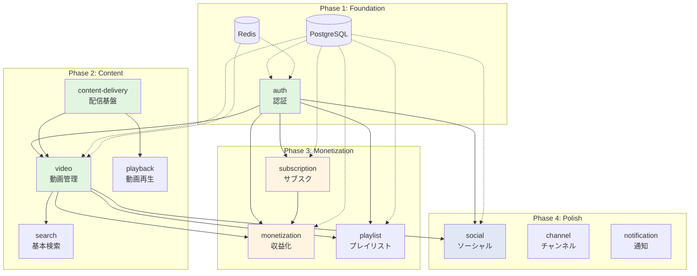

# Backend Implementation Plan - Overview

**プロジェクト**: Video Platform Backend
**作成日**: 2025-10-26
**最終更新**: 2025-10-26
**ステータス**: 計画中

---

## 📋 ドキュメント概要

このドキュメントは、Video Platformバックエンドの **実装計画概要** です。

**重要な原則**:
- ✅ **MVP Milestone（必達目標）のみコミット**: 16-20週間で確実に達成可能な機能セットに集中
- 🚀 **Stretch Goals（条件付き拡張）**: MVP成功後、ビジネス指標とリソースに基づいて判断
- ⚠️ **Decision Gates（決定ゲート）**: 各Stretch Goal実施前に go/no-go 判断
- 🛡️ **Contingency Buffers（予備期間）**: 30%の追加時間を確保

---

## 1. プロジェクト全体像

### 1.1 MVP Milestone（必達目標） - 16-20週間

**スコープ:**
- ✅ 認証・アカウント管理（`/auth` 統合認証ページ）
- ✅ 動画CRUD（S3, MediaConvert, CloudFront）
- ✅ 基本サブスクリプション（Stripe統合のみ）
- ✅ 基本ソーシャル機能（いいね、コメント、フォロー、通知）
- ✅ 基本検索（PostgreSQL全文検索）
- ✅ プレイリスト管理
- ✅ クリエイター収益管理（基礎）

**Technical Goals:**
- API応答時間: < 500ms (P95)
- 同時接続: 500-1,000ユーザー
- 稼働率: 99% SLA
- テストカバレッジ: > 80%

**Contingency Buffer:** +30% (4-6週間追加) = **合計20-26週間**

---

### 1.2 Stretch Goals（条件付き拡張機能）

#### 🚀 Stretch Goal 1: ショート動画（+4-6週間）

**Decision Gate:**
- ✅ MVP完全稼働（全機能リリース済み）
- ✅ ユーザー数 > 5,000人
- ✅ チームリソース確保（+1エンジニア）
- ✅ ビジネス判断: TikTok風機能が戦略的優先事項

**スコープ:**
- ショート動画CRUD（最大60秒）
- スワイプ型フィードAPI
- 縦型動画最適化
- ショート専用トランスコード設定

**High-Risk Items:**
- 縦型動画のトランスコード最適化
- スワイプUIのバックエンド最適化（高速フェッチ）

---

#### 🚀 Stretch Goal 2: ライブ配信（+6-8週間）

**Decision Gate:**
- ✅ MVP完全稼働
- ✅ AWS MediaLive技術検証成功（PoC完了）
- ✅ 予算確保（MediaLive月額コスト: $500-2,000）
- ✅ チームリソース確保（+1-2エンジニア）
- ✅ ビジネス判断: ライブ配信が収益化戦略の中核

**スコープ:**
- RTMP Ingest（MediaLive）
- HLS ライブ配信
- リアルタイムチャット（WebSocket）
- スーパーチャット
- ライブアーカイブ保存

**High-Risk Items:**
- MediaLive設定の複雑性（RTMP → HLS変換）
- WebSocket管理（同時接続数スケーリング）
- 3秒以下の低遅延達成

---

#### 🚀 Stretch Goal 3: Elasticsearch検索・推薦（+4-6週間）

**Decision Gate:**
- ✅ MVP完全稼働
- ✅ PostgreSQL全文検索が性能限界に到達（> 2秒応答時間）
- ✅ 動画数 > 50,000本
- ✅ 予算確保（Elasticsearch月額コスト: $100-500）

**スコープ:**
- Elasticsearch セットアップ
- 高度な全文検索（タイトル、説明、タグ）
- おすすめ動画アルゴリズム（協調フィルタリング）
- トレンド分析

**High-Risk Items:**
- Elasticsearchインデックス最適化
- データ同期戦略（PostgreSQL → Elasticsearch）

---

#### 🚀 Stretch Goal 4: CCBill統合（+2-3週間）

**Decision Gate:**
- ✅ MVP完全稼働
- ✅ アダルトコンテンツ配信が明確なビジネス戦略
- ✅ CCBillアカウント承認取得
- ✅ 法的コンプライアンス確認完了

**スコープ:**
- CCBill Checkout URL生成
- CCBill Webhook処理
- アダルトコンテンツ年齢確認
- CCBill決済履歴管理

---

#### 🚀 Stretch Goal 5: Netflix風コンテンツ（+6-8週間）

**Decision Gate:**
- ✅ MVP完全稼働
- ✅ コンテンツパートナーシップ契約締結
- ✅ IP権利管理の法的基盤確立
- ✅ ビジネス判断: Netflix風エクスペリエンスが差別化要因

**スコープ:**
- 映画・TVシリーズ管理
- シーズン・エピソード構造
- IP権利管理
- 視聴進捗管理（シリーズ単位）

---

#### 🚀 Stretch Goal 6: エンタープライズグレード（+8-12週間）

**Decision Gate:**
- ✅ MVP完全稼働
- ✅ ユーザー数 > 50,000人
- ✅ 現在の性能指標が限界に到達
- ✅ 予算確保（インフラスケーリングコスト: $5,000-15,000/月）

**スコープ:**
- 99.9% SLA（現MVP: 99%）
- API応答時間 < 200ms (P95)（現MVP: < 500ms）
- 10,000-100,000同時接続対応（現MVP: 500-1,000）
- マルチリージョン展開
- 高度な監視・アラート

---

### 1.3 リスク管理方針

**Risk Mitigation Strategy:**

1. **MVPのみコミット**: Stretch Goalsは全て条件付き
2. **決定ゲートで評価**: MVPリリース後、以下の基準で判断
   - ✅ ビジネスKPI（ユーザー数、収益、エンゲージメント）
   - ✅ 技術指標（性能、安定性、負荷状況）
   - ✅ リソース確保（予算、エンジニア）
3. **段階的投資**: 各Stretch Goal個別に予算・リソース確保
4. **撤退オプション**: 任意のStretch Goalは中止可能（サンクコスト回避）

**Fallback Plan:**
- Stretch Goal 2 (ライブ配信) が失敗 → MVP機能で運用継続
- Stretch Goal 3 (Elasticsearch) が失敗 → PostgreSQL全文検索継続使用

---

## 2. MVP開発フェーズ詳細

**重要**: 以下のフェーズは **MVP Milestone（必達目標）** のみを含みます。Stretch Goalsは含まれません。

---

### Phase 1: Foundation（基盤構築）

**期間**: 3週間（+1週間バッファ）
**ゴール**: 認証、データベース、基本インフラを構築する

#### 主要成果物

1. **プロジェクト初期化**
   - Node.js 20 + TypeScript 5 + Fastify 4.x プロジェクト作成
   - ESLint、Prettier、Husky 設定
   - レイヤードアーキテクチャ構築（Controller / Use Case / Repository）

2. **データベースセットアップ**
   - PostgreSQL 15+ スキーマ設計（Prisma 5.x）
   - マイグレーション作成
   - シードデータ投入

3. **認証システム（01-authentication）**
   - ユーザー登録（メール確認、プロフィール作成）
   - ログイン・ログアウト（Expo Router `/auth` 対応）
   - JWT 発行（アクセス + リフレッシュトークン）
   - パスワードリセット

4. **インフラ基盤**
   - Redis 7.x セットアップ（セッション管理）
   - AWS S3 バケット作成
   - CI/CD パイプライン（GitHub Actions）

#### 依存関係

なし（プロジェクト開始時点）

#### 退出基準

- ✅ ユーザーが `/auth` で登録・ログインできる
- ✅ JWT トークンが正常に発行される
- ✅ メール確認が機能する
- ✅ パスワードリセットが機能する
- ✅ 単体テスト + 統合テスト パス（カバレッジ > 80%）
- ✅ CI/CD パイプラインで自動テスト実行

---

### Phase 2: Content Delivery（コンテンツ配信）

**期間**: 5週間（+2週間バッファ）
**ゴール**: 通常動画配信の基盤、動画CRUD、基本ソーシャル機能を完成させる

#### 主要成果物

1. **コンテンツ配信基盤（03-content-delivery）**
   - AWS S3 presigned URL 発行
   - MediaConvert トランスコード連携（通常動画のみ、ショート動画は対象外）
   - CloudFront CDN 配信
   - 署名付きURL 生成

2. **動画管理（04-video-management）**
   - 動画CRUD（作成、取得、更新、削除）
   - サムネイル生成
   - カテゴリ、タグ管理
   - プライバシー設定（public/unlisted/private）
   - アダルトフラグ

3. **動画再生（05-video-playback）**
   - HLS ストリーミング
   - 視聴履歴保存
   - 進捗管理（途中再生）
   - 視聴回数カウント
   - 動画品質選択（自動切替: 1080p, 720p, 480p, 360p）

4. **動画インタラクション（基本ソーシャル）**
   - いいね機能
   - コメント機能（返信対応）
   - コメントいいね
   - 通報機能

5. **基本検索機能**
   - PostgreSQL 全文検索（タイトル、説明、タグ）
   - カテゴリフィルター
   - 人気順、新着順ソート

#### 依存関係

- Phase 1 完了（認証必須）

#### 退出基準

- ✅ 動画アップロード → トランスコード → CDN配信 が動作
- ✅ HLS で4解像度が再生可能
- ✅ CloudFront から配信される
- ✅ いいね、コメントが正常動作
- ✅ 基本検索が1秒以内に結果返却
- ✅ 全エンドポイントのテストパス

**注記**: ショート動画機能は Stretch Goal 1 に移行。MVP では通常動画のみサポート。

---

### Phase 3: Monetization（収益化 - MVP版）

**期間**: 4週間（+1週間バッファ）
**ゴール**: サブスクリプション決済（Stripeのみ）、クリエイター収益化基盤を完成させる

#### 主要成果物

1. **サブスクリプション管理（02-subscription）**
   - プラン定義（Free、Premium）
   - プラン切り替え
   - キャンセル、再開

2. **Stripe 統合**
   - Checkout Session 作成
   - Webhook 処理（`checkout.session.completed` 等）
   - 決済履歴管理
   - カード情報管理

3. **投げ銭機能（Stripe のみ）**
   - 動画への投げ銭
   - Stripe 決済処理

4. **クリエイター収益管理（09-monetization - 基礎）**
   - 収益記録
   - 出金申請（Stripe Connect）
   - 税務情報管理（基本版）
   - 収益ダッシュボード（基本版）

5. **プレイリスト機能**
   - プレイリストCRUD
   - 動画追加・削除・並び替え
   - 公開設定（public/private）

#### 依存関係

- Phase 1 完了（認証必須）
- Phase 2 完了（動画管理必須）
- Stripe アカウント作成完了

#### 退出基準

- ✅ ユーザーがPremiumプランに課金できる（Stripeのみ）
- ✅ Stripeのwebhookが正常処理される
- ✅ 投げ銭が機能する
- ✅ クリエイターが出金申請できる
- ✅ プレイリストが作成・共有できる

**注記**: CCBill統合は Stretch Goal 4 に移行。MVP では Stripe のみサポート。

---

### Phase 4: Polish & Optimization（仕上げ・最適化）

**期間**: 3週間（+1週間バッファ）
**ゴール**: MVP機能の完成度向上、パフォーマンス最適化、本番環境準備

#### 主要成果物

1. **パフォーマンス最適化**
   - データベースインデックス最適化
   - クエリチューニング
   - Redisキャッシング戦略
   - CDN設定最適化

2. **ソーシャル機能拡張**
   - フォロー・フォロワー完成
   - 通知システム（基本版: メール + アプリ内通知）
   - アクティビティフィード

3. **チャンネル機能**
   - クリエイタープロフィール
   - チャンネル設定
   - 基本統計情報（再生回数、登録者数）

4. **セキュリティ強化**
   - WAF設定（SQL Injection、XSS対策）
   - Rate Limiting
   - CORS設定
   - SSL/TLS設定
   - セキュリティヘッダー

5. **監視・ロギング**
   - CloudWatch 設定
   - アプリケーションログ（Winston）
   - エラーアラート（Sentry）
   - パフォーマンス監視

6. **ドキュメント整備**
   - API仕様書（Swagger/OpenAPI）
   - デプロイ手順書
   - 運用マニュアル（基本版）

#### 依存関係

- Phase 1-3 全て完了

#### 退出基準

- ✅ API応答時間 < 500ms（P95）
- ✅ データベースクエリ最適化完了
- ✅ フォロー・通知機能が動作
- ✅ セキュリティ基準クリア
- ✅ 監視・アラート稼働

---

### Phase 5: MVP Launch Preparation（MVP リリース準備）

**期間**: 2週間（+1週間バッファ）
**ゴール**: 本番環境デプロイ、負荷テスト、最終検証

#### 主要成果物

1. **本番環境構築**
   - AWS本番環境構築（VPC、RDS、ElastiCache、S3）
   - Load Balancer 設定
   - Auto Scaling 設定（500-1,000ユーザー対応）
   - CloudFront 本番設定

2. **負荷テスト（MVP スケール）**
   - JMeter / k6 による負荷テスト
   - **500-1,000同時接続**テスト（MVP目標）
   - ボトルネック特定・改善

3. **最終検証**
   - 全機能のE2Eテスト（Playwright）
   - セキュリティ監査（基本レベル）
   - データバックアップ設定
   - 障害復旧手順確認

4. **運用準備**
   - エラー対応フロー確立
   - オンコール体制構築（初期版）
   - ユーザーサポート体制準備

#### 依存関係

- Phase 1-4 全て完了

#### 退出基準

- ✅ 本番環境でAPI稼働
- ✅ 負荷テスト合格（**500-1,000同時接続** - MVP目標）
- ✅ API応答時間 < 500ms（P95）
- ✅ 稼働率 99% 達成
- ✅ 監視・アラート稼働
- ✅ 全E2Eテストパス
- ✅ セキュリティ基本監査パス

**🎯 MVP Success Gate**: この時点で全MVP機能が完成。Stretch Goals の実施判断を行う。

---

## 3. 機能優先順位マトリックス（MoSCoW分析）

### Must Have（MVP必須機能） - 16-20週間でコミット

| 機能 | 理由 | Phase |
|-----|------|-------|
| 認証（01） | 全機能の前提 | 1 |
| サブスクリプション（02 - Stripeのみ） | 収益の根幹 | 3 |
| コンテンツ配信（03 - 通常動画のみ） | 動画配信の基盤 | 2 |
| 動画管理（04 - 通常動画のみ） | コアバリュー | 2 |
| 動画再生（05） | コアバリュー | 2 |
| 基本ソーシャル（いいね、コメント、フォロー） | 最低限のエンゲージメント | 2, 4 |
| 基本検索（PostgreSQL全文検索） | 最低限のUX | 2 |
| プレイリスト（11） | 基本UX向上 | 3 |
| クリエイター収益（09 - 基礎） | クリエイター獲得の最低条件 | 3 |

### Conditional - Stretch Goals（条件付き拡張機能）

| 機能 | 理由 | Stretch Goal | 追加期間 |
|-----|------|--------------|---------|
| ショート動画（06, 07） | TikTok風差別化 | Stretch Goal 1 | +4-6週間 |
| ライブ配信（08） | リアルタイム収益化 | Stretch Goal 2 | +6-8週間 |
| Elasticsearch検索・推薦（12） | 高度なUX | Stretch Goal 3 | +4-6週間 |
| CCBill統合 | アダルトコンテンツ対応 | Stretch Goal 4 | +2-3週間 |
| Netflix風コンテンツ（14） | プレミアムコンテンツ | Stretch Goal 5 | +6-8週間 |
| エンタープライズグレード | 大規模スケーリング | Stretch Goal 6 | +8-12週間 |

### Won't Have（v1.0では明確に対象外）

- 動画編集機能
- コミュニティ投稿
- メンバーシップ制度（Patreon風）
- ストーリー機能
- ショッピング機能
- バッジシステム

---

## 4. MVPモジュール依存関係グラフ

**凡例**:
- 🟢 緑: Phase 1-2（基盤・コンテンツ）
- 🟡 黄: Phase 3（収益化）
- 🔵 青: Phase 4（仕上げ）

**注記**: このグラフは **MVPのみ** を表示。Stretch Goals（ショート動画、ライブ配信、Elasticsearch、CCBill、Netflix）は含まれません。

---

## 5. リスク評価

### 5.1 MVP技術リスク

| リスク | 確率 | 影響度 | 対策 |
|-------|-----|--------|------|
| AWS MediaConvert統合難航 | 中 | 高 | 事前PoC実施（Phase 1完了後）、代替案（FFmpeg）準備 |
| Stripe Webhook処理失敗 | 中 | 高 | べき等性確保、リトライ機構、テストモード検証 |
| PostgreSQL全文検索性能不足 | 低 | 中 | MVP規模（< 10,000動画）では十分、Elasticsearchは Stretch Goal 3 で対応 |
| 同時接続数上限（MVP目標: 1,000） | 低 | 中 | 負荷テスト早期実施、Auto Scaling設定 |

### 5.2 MVPリソースリスク

| リスク | 確率 | 影響度 | 対策 |
|-------|-----|--------|------|
| エンジニア不足 | 高 | 高 | 外部リソース活用、スコープ調整（Stretch Goals削減） |
| AWS専門知識不足 | 中 | 中 | AWS認定資格取得、AWSサポート契約 |
| 決済API知識不足（Stripe） | 中 | 高 | Stripe公式ドキュメント精読、コミュニティ活用 |

### 5.3 MVPタイムラインリスク

| リスク | 確率 | 影響度 | 対策 |
|-------|-----|--------|------|
| Phase 2が予定超過 | 中 | 高 | バッファ2週間確保、Must Haveに集中 |
| 統合テスト遅延 | 中 | 中 | CI/CD早期構築（Phase 1）、並行テスト |
| 本番環境構築遅延 | 低 | 中 | Phase 1でインフラ基礎構築開始 |

### 5.4 緩和戦略

1. **技術的リスク**
   - 各Phaseで技術的PoC（概念実証）を先行実施
   - 外部サービス（Stripe、AWS）のサンドボックス環境で事前検証
   - 代替技術の選定（例: MediaConvert → FFmpeg）

2. **リソースリスク**
   - フルスタックエンジニア採用で柔軟性確保
   - コードレビュー文化で知識共有
   - ペアプログラミングで属人化防止

3. **タイムラインリスク**
   - 各Phase終了時にバッファ期間設定（30%）
   - Stretch Goals削減による柔軟な対応
   - デイリースタンドアップで進捗共有

---

## 6. MVPマイルストーン & ゲート

### Week 4: Phase 1 完了ゲート

**デモ内容**:
- ユーザー登録（`/auth`） → メール確認 → ログイン
- JWT トークン発行確認
- パスワードリセットフロー

**合否判定**:
- ✅ 全テストパス（カバレッジ > 80%）
- ✅ CI/CD稼働
- ✅ PostgreSQL + Redis接続確認

---

### Week 11: Phase 2 完了ゲート

**デモ内容**:
- 動画アップロード → トランスコード → HLS再生
- いいね、コメント機能
- 基本検索（PostgreSQL全文検索）

**合否判定**:
- ✅ 動画が4解像度で再生可能
- ✅ CloudFrontから配信確認
- ✅ 全エンドポイントテストパス
- ✅ 検索応答時間 < 1秒

---

### Week 16: Phase 3 完了ゲート

**デモ内容**:
- Premiumプラン課金（Stripe） → プラン有効化
- 投げ銭機能（Stripe）
- クリエイター収益ダッシュボード
- プレイリスト作成・共有

**合否判定**:
- ✅ Stripe Webhookが正常処理される
- ✅ 投げ銭が完了する
- ✅ クリエイターが出金申請できる
- ✅ プレイリストが動作する

**注記**: CCBill決済は Stretch Goal 4 に移行。このゲートでは検証しない。

---

### Week 20: Phase 4 完了ゲート

**デモ内容**:
- フォロー・通知機能
- チャンネル統計情報
- パフォーマンス最適化結果報告

**合否判定**:
- ✅ API応答時間 < 500ms（P95）
- ✅ フォロー・通知が動作
- ✅ セキュリティ基準クリア
- ✅ 監視・アラート稼働

---

### Week 23: MVP Launch Gate（最終判定）

**デモ内容**:
- 本番環境で全機能デモ
- 負荷テスト結果報告（500-1,000同時接続）
- セキュリティ監査結果報告

**合否判定**:
- ✅ **500-1,000同時接続**テスト合格（MVP目標）
- ✅ API応答 < 500ms（P95）
- ✅ 稼働率 99% 達成
- ✅ セキュリティ監査パス（基本レベル）
- ✅ 全E2Eテストパス

**Go/No-Go判断**:
- **Go**: MVP本番リリース → **Stretch Goals決定フェーズへ**
- **No-Go**: 追加1-2週間の修正期間

**🚀 Stretch Goals Decision Meeting**:
- MVP成功後、ビジネスKPI、技術指標、リソース状況を基に Stretch Goals 1-6 の優先順位決定
- 各Stretch Goal のDecision Gate条件を評価
- 実施する Stretch Goals を選定（0個-6個すべて可能）

---

## 7. リソース計画

### 7.1 開発チーム（MVP）

| 役割 | 人数 | 主要責任 |
|-----|-----|---------|
| **Tech Lead** | 1名 | アーキテクチャ設計、コードレビュー、技術判断 |
| **Backend Engineer** | 2名 | API実装、テスト、ドキュメント |
| **DevOps Engineer** | 1名 | インフラ構築、CI/CD、監視 |
| **QA Engineer** | 1名 | テスト計画、E2Eテスト、負荷テスト |
| **合計** | 5名 | - |

**最小構成（スタートアップ）**:
- **フルスタックエンジニア**: 2-3名（Tech Lead兼務）
- 期間: 20-26週間（5-6.5ヶ月）

**Stretch Goals追加リソース**:
- Stretch Goal 1 (ショート動画): +1エンジニア
- Stretch Goal 2 (ライブ配信): +1-2エンジニア
- Stretch Goal 6 (エンタープライズ): +1 DevOpsエンジニア

---

### 7.2 インフラリソース

#### 開発環境（MVP）

| リソース | スペック | 月額コスト |
|---------|---------|----------|
| RDS PostgreSQL | db.t3.medium | $50 |
| ElastiCache Redis | cache.t3.micro | $15 |
| S3 | 100GB | $3 |
| CloudFront | 100GB転送 | $10 |
| MediaConvert | 50時間/月 | $75 |
| 合計 | - | **$153/月** |

**注記**: MediaLive（ライブ配信）、Elasticsearch は開発環境に含まれません（Stretch Goals）。

---

#### 本番環境（MVP - 1,000同時接続想定）

| リソース | スペック | 月額コスト |
|---------|---------|----------|
| EC2 (API Server) | t3.medium x 2 + ALB | $150 |
| RDS PostgreSQL | db.r5.large | $250 |
| RDS Read Replica | db.r5.large | $250 |
| ElastiCache Redis | cache.r5.large | $150 |
| S3 | 1TB | $23 |
| CloudFront | 1TB転送 | $85 |
| MediaConvert | 200時間/月 | $300 |
| 合計 | - | **$1,208/月** |

**注記**: MediaLive（$300-500/月）、Elasticsearch（$100-200/月）、CCBill手数料 は含まれません（Stretch Goals）。

---

#### 本番環境（Stretch Goal 6 - 10,000同時接続想定）

| リソース | スペック | 月額コスト |
|---------|---------|----------|
| EC2 (API Server) | t3.large x 4 + ALB | $500 |
| RDS PostgreSQL | db.r5.xlarge | $500 |
| RDS Read Replica x2 | db.r5.large x 2 | $500 |
| ElastiCache Redis | cache.r5.xlarge | $300 |
| S3 | 5TB | $115 |
| CloudFront | 5TB転送 | $425 |
| MediaConvert | 500時間/月 | $750 |
| MediaLive | 240時間/月 | $3,000 |
| Elasticsearch | r5.large.search x 2 | $600 |
| 合計 | - | **$6,690/月** |

**注記**: このスケールは Stretch Goal 6 実施時のみ必要。MVP では不要。

---

### 7.3 サードパーティサービス（MVP）

| サービス | 用途 | 月額コスト |
|---------|-----|----------|
| Stripe | 決済処理（サブスク、投げ銭） | 手数料: 3.6% |
| AWS SES | メール送信 | $0.10/1000通 |
| GitHub | リポジトリ | $4/user |
| Sentry | エラー監視 | $26/月 |
| 合計 | - | **約$50/月** + 決済手数料 |

**注記**: CCBill（手数料: 10-15%）は Stretch Goal 4 実施時のみ必要。

---

### 7.4 総コスト見積もり

#### MVP開発期間（20-26週間）

| 項目 | コスト |
|-----|-------|
| エンジニア人件費（5名 x 6ヶ月） | $300,000-450,000 |
| 開発環境インフラ（6ヶ月） | $918 |
| 本番環境インフラ（初月のみ） | $1,208 |
| サードパーティサービス（6ヶ月） | $300 |
| **合計** | **約$302,426-$452,426** |

#### MVP本番運用（月額）

| 項目 | コスト |
|-----|-------|
| 本番インフラ（1,000同時接続） | $1,208 |
| サードパーティサービス | $50 |
| Stripe決済手数料（変動） | 変動 |
| **合計** | **約$1,258/月** + 決済手数料 |

---

## 8. 品質保証計画

### 8.1 テスト戦略

#### 単体テスト（Jest）

- **カバレッジ目標**: 80%以上
- **対象**: 全Use Case、Domain Entity、Repository
- **実行タイミング**: コミット前（Husky）、CI/CD

#### 統合テスト（Supertest）

- **カバレッジ目標**: 主要フロー100%
- **対象**: 全APIエンドポイント
- **実行タイミング**: CI/CD、デプロイ前

#### E2Eテスト（Playwright）

- **対象**: クリティカルユーザーフロー
  - `/auth` でログイン → 動画アップロード → 再生
  - Premiumプラン課金（Stripe） → プラン有効化
  - 投げ銭 → クリエイター収益確認
- **実行タイミング**: デプロイ前、週次

#### 負荷テスト（JMeter / k6）

- **MVP目標**: 500-1,000同時接続
- **シナリオ**:
  - 動画視聴（HLS再生）: 500並列
  - API呼び出し（動画一覧取得）: 100並列
  - 認証フロー: 50並列
- **実行タイミング**: Phase 5（リリース前）

**注記**: 10,000同時接続テストは Stretch Goal 6 実施時のみ。

---

### 8.2 品質基準（MVP）

| 指標 | MVP目標 | 測定方法 |
|-----|---------|---------|
| 単体テストカバレッジ | > 80% | Jest Coverage Report |
| 統合テストカバレッジ | > 70% | Supertest Coverage |
| E2Eテスト成功率 | 100% | Playwright Report |
| API応答時間（P95） | < 500ms | CloudWatch Metrics |
| エラー率 | < 0.5% | Sentry Error Rate |
| 稼働率 | > 99% | CloudWatch Uptime |

**注記**: Stretch Goal 6 では API < 200ms、稼働率 > 99.9% に向上。

---

## 9. 開発KPI

### 9.1 速度KPI（MVP）

| 指標 | 目標 | 測定方法 |
|-----|-----|---------|
| Sprint Velocity | 20-30 Story Points/週 | Jira/GitHub Projects |
| コミット頻度 | 平均2-3コミット/日/エンジニア | GitHub Insights |
| PR マージ時間 | < 48時間 | GitHub PR Metrics |
| コードレビュー時間 | < 24時間 | GitHub PR Metrics |

### 9.2 品質KPI（MVP）

| 指標 | 目標 | 測定方法 |
|-----|-----|---------|
| API応答時間（P95） | < 500ms | CloudWatch Metrics |
| エラー率 | < 0.5% | Sentry Error Rate |
| 稼働率 | > 99% | CloudWatch Uptime |
| デプロイ成功率 | > 95% | CI/CD Metrics |

### 9.3 ビジネスKPI（MVP）

| 指標 | 目標 | 測定方法 |
|-----|-----|---------|
| MVP機能完成度 | 100% | Feature Checklist |
| スケジュール遵守率 | > 90% | Planned vs Actual |
| バジェット遵守率 | ±10% | Budget vs Actual |

---

## 10. 次ステップ

### 10.1 即時アクション（Week 0）

1. **チーム編成**
   - エンジニア採用・アサイン
   - キックオフミーティング開催

2. **環境準備**
   - AWS アカウント作成
   - GitHub リポジトリ作成
   - Stripe サンドボックスアカウント作成

**注記**: CCBillアカウント作成は不要（Stretch Goal 4 実施時のみ）。

---

### 10.2 Phase 1 開始（Week 1）

- プロジェクト初期化
- データベース設計開始
- 認証機能実装開始

---

### 10.3 詳細計画レビュー

本概要計画に基づき、以下の詳細計画を別途作成:
- `IMPLEMENTATION-PLAN-DETAILED.md` - 機能別詳細実装計画
- `DATABASE-MIGRATION-PLAN.md` - データベースマイグレーション計画
- `CICD-PIPELINE-PLAN.md` - CI/CDパイプライン詳細
- `TESTING-STRATEGY.md` - テスト戦略詳細

---

## 11. 関連ドキュメント

- [`IMPLEMENTATION-PLAN-DETAILED.md`](./IMPLEMENTATION-PLAN-DETAILED.md) - 機能別詳細実装計画
- [`/docs/specs/architecture/system-overview.md`](../specs/architecture/system-overview.md) - システムアーキテクチャ概要（Expo Router統一）
- [`/docs/specs/architecture/tech-stack.md`](../specs/architecture/tech-stack.md) - 技術スタック詳細
- [`/docs/specs/references/data-models.md`](../specs/references/data-models.md) - データモデル詳細
- [`/docs/specs/references/api-endpoints.md`](../specs/references/api-endpoints.md) - APIエンドポイント一覧
- [`/docs/tests/TEST-SUMMARY-REPORT.md`](../tests/TEST-SUMMARY-REPORT.md) - テストサマリー（Expo Router `/auth` 対応）

---

**作成日**: 2025-10-26
**最終更新**: 2025-10-26
**バージョン**: 2.0（MVP + Stretch Goals モデル）

---

## Appendix: Stretch Goals詳細

### Stretch Goal 1: ショート動画

**技術仕様**:
- 最大60秒制限
- 縦型動画最適化（9:16 aspect ratio）
- スワイプ型フィードAPI（無限スクロール対応）
- ショート専用トランスコード設定（低解像度優先）

**API追加**:
- `POST /shorts` - ショート動画アップロード
- `GET /shorts/feed` - スワイプ型フィード（ページネーション）
- `POST /shorts/:id/like` - いいね
- `POST /shorts/:id/comments` - コメント

---

### Stretch Goal 2: ライブ配信

**技術仕様**:
- AWS MediaLive: RTMP Ingest → HLS出力
- WebSocket: リアルタイムチャット
- スーパーチャット: ライブ配信中の投げ銭
- アーカイブ保存: ライブ終了後、S3へ保存 → MediaConvert → 通常動画化

**API追加**:
- `POST /lives` - ライブ作成
- `POST /lives/:id/start` - ライブ開始（RTMP URL発行）
- `POST /lives/:id/end` - ライブ終了
- `GET /lives/:id/chat` - WebSocketチャット接続
- `POST /lives/:id/superchat` - スーパーチャット

---

### Stretch Goal 3: Elasticsearch検索・推薦

**技術仕様**:
- Elasticsearch 8.x セットアップ
- データ同期: PostgreSQL → Elasticsearch（Logstash / 定期バッチ）
- 全文検索: タイトル、説明、タグ
- おすすめアルゴリズム: 協調フィルタリング（視聴履歴ベース）

**API修正**:
- `GET /search` - Elasticsearchベース検索（既存APIを高速化）
- `GET /recommendations` - おすすめ動画（新規）

---

### Stretch Goal 4: CCBill統合

**技術仕様**:
- CCBill Checkout URL生成
- CCBill Webhook処理（決済完了通知）
- アダルトコンテンツ年齢確認フロー

**API追加**:
- `POST /payment/ccbill/checkout` - CCBill Checkout URL生成
- `POST /webhooks/ccbill` - CCBill Webhook受信

---

### Stretch Goal 5: Netflix風コンテンツ

**技術仕様**:
- 映画・TVシリーズ管理（新テーブル: `movies`, `tv_series`, `seasons`, `episodes`）
- IP権利管理（著作権情報、配信期間）
- 視聴進捗管理（シリーズ単位）

**API追加**:
- `POST /movies` - 映画作成
- `POST /tv-series` - TVシリーズ作成
- `POST /tv-series/:id/seasons` - シーズン作成
- `POST /seasons/:id/episodes` - エピソード作成
- `GET /movies/:id/watch-progress` - 視聴進捗

---

### Stretch Goal 6: エンタープライズグレード

**技術仕様**:
- 99.9% SLA（ダウンタイム < 43分/月）
- API応答時間 < 200ms (P95)
- 10,000-100,000同時接続対応
- マルチリージョン展開（US-East, EU-West, AP-Northeast）
- 高度な監視（Datadog / New Relic統合）

**インフラ変更**:
- RDS Multi-AZ
- ElastiCache Cluster Mode
- CloudFront複数オリジン
- ALB + Auto Scaling（最大20インスタンス）

---

**End of Appendix**
