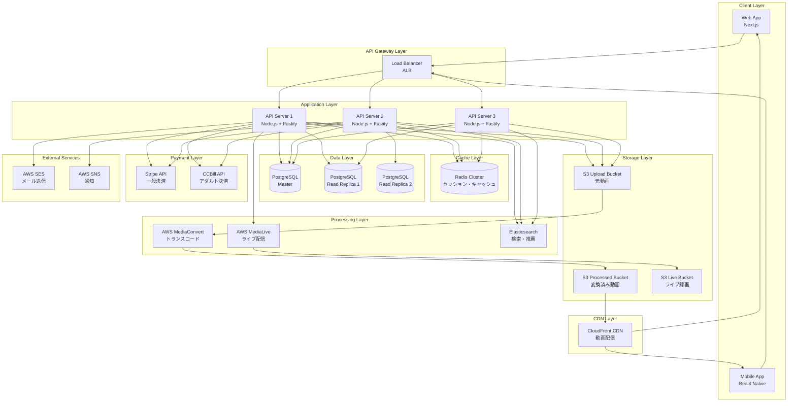

# システムアーキテクチャ概要

## 1. 概要

本ドキュメントでは、動画配信プラットフォームの全体的なシステムアーキテクチャ、コンポーネント構成、レイヤードアーキテクチャ、モジュール構造、およびデータフローについて詳細に説明する。

### 1.1 アーキテクチャの目標

- **スケーラビリティ**: 100万ユーザー、10万同時接続に対応
- **保守性**: モジュール化されたコードベースで変更容易性を確保
- **パフォーマンス**: API応答時間 < 200ms、動画開始時間 < 2秒
- **セキュリティ**: エンドツーエンド暗号化、RBAC、監査ログ
- **可用性**: 99.9% SLA、自動フェイルオーバー

---

## 2. システムアーキテクチャ図

### 2.1 全体構成図（Mermaid）



### 2.2 ASCII版アーキテクチャ図

```
┌─────────────────────────────────────────────────────────────────┐
│                         Client Layer                            │
│  ┌──────────────┐                      ┌──────────────┐         │
│  │  Web App     │                      │  Mobile App  │         │
│  │  (Next.js)   │                      │  (React      │         │
│  │              │                      │   Native)    │         │
│  └──────┬───────┘                      └──────┬───────┘         │
└─────────┼────────────────────────────────────┼─────────────────┘
          │                                    │
          └────────────────┬───────────────────┘
                           │
          ┌────────────────▼─────────────────┐
          │   CloudFront CDN (動画配信)      │
          └────────────────┬─────────────────┘
                           │
          ┌────────────────▼─────────────────┐
          │   Application Load Balancer      │
          └────────────────┬─────────────────┘
                           │
          ┌────────────────┴─────────────────┐
          │                                  │
┌─────────▼──────┐  ┌──────────┐  ┌────────▼─────┐
│  API Server 1  │  │  API     │  │  API Server  │
│  (Node.js)     │  │  Server  │  │  3 (Node.js) │
│                │  │  2       │  │              │
└────┬───┬───┬───┘  └─┬───┬───┬┘  └─┬───┬───┬───┘
     │   │   │        │   │   │     │   │   │
     │   │   └────────┼───┼───┼─────┘   │   │
     │   │            │   │   │         │   │
     │   └────────────┼───┴───┼─────────┘   │
     │                │       │             │
┌────▼────────────────▼───┐ ┌─▼─────────────▼──┐
│  PostgreSQL Master      │ │  Redis Cluster   │
│  (Write)                │ │  (Cache/Session) │
└─────────────────────────┘ └──────────────────┘
     │
     ├──────────┬──────────┐
     │          │          │
┌────▼────┐ ┌──▼─────┐ ┌──▼─────┐
│ Replica │ │Replica │ │Replica │
│    1    │ │   2    │ │   3    │
└─────────┘ └────────┘ └────────┘

┌──────────────────────────────────────────────┐
│          Storage & Processing Layer          │
│                                              │
│  ┌───────────┐  ┌──────────────┐  ┌───────┐ │
│  │ S3 Upload │─▶│MediaConvert  │─▶│  S3   │ │
│  │  Bucket   │  │(Transcode)   │  │Process│ │
│  └───────────┘  └──────────────┘  └───┬───┘ │
│                                       │     │
│  ┌───────────┐  ┌──────────────┐     │     │
│  │  RTMP     │─▶│ MediaLive    │─────┘     │
│  │  Ingest   │  │ (Live HLS)   │           │
│  └───────────┘  └──────────────┘           │
│                                              │
│  ┌────────────────────────────────────────┐ │
│  │  Elasticsearch (検索・推薦エンジン)    │ │
│  └────────────────────────────────────────┘ │
└──────────────────────────────────────────────┘

┌──────────────────────────────────────────────┐
│          External Services Layer             │
│                                              │
│  ┌──────────┐  ┌──────────┐  ┌───────────┐  │
│  │ Stripe   │  │ CCBill   │  │  AWS SES  │  │
│  │ (決済)   │  │ (決済)   │  │  (Email)  │  │
│  └──────────┘  └──────────┘  └───────────┘  │
└──────────────────────────────────────────────┘
```

---

## 3. レイヤードアーキテクチャ

本システムは、**レイヤードアーキテクチャ（Layered Architecture）** を採用し、責任の分離とモジュール性を実現する。

### 3.1 レイヤー構成

```
┌─────────────────────────────────────────────────────┐
│           Interface Layer (インターフェース層)        │
│  - REST API Controllers                             │
│  - GraphQL Resolvers (オプション)                   │
│  - Middleware (認証、バリデーション、エラーハンドリング)│
│  - モジュール横断なので backend/src/interface/       │
└─────────────────────────────────────────────────────┘
                         ↓
┌─────────────────────────────────────────────────────┐
│        Application Layer (アプリケーション層)         │
│  - Use Cases (ビジネスロジック)                      │
│  - Application Services                             │
│  - DTOs (Data Transfer Objects)                     │
│  - モジュール横断なので backend/src/application/     │
└─────────────────────────────────────────────────────┘
                         ↓
┌─────────────────────────────────────────────────────┐
│            Domain Layer (ドメイン層)                 │
│  - Entities (エンティティ)                           │
│  - Value Objects                                    │
│  - Domain Services                                  │
│  - 各モジュール内に配置 (modules/*/domain/)          │
└─────────────────────────────────────────────────────┘
                         ↓
┌─────────────────────────────────────────────────────┐
│      Infrastructure Layer (インフラストラクチャ層)     │
│  - Repositories (データアクセス)                      │
│  - External Service Clients (Stripe, CCBill, AWS)  │
│  - Database Adapters (TypeORM, Prisma)             │
│  - 各モジュール内に配置 (modules/*/infrastructure/)  │
└─────────────────────────────────────────────────────┘
```

### 3.2 ディレクトリ構造

```
backend/src/
├── application/                # Application Layer (モジュール横断)
│   ├── services/              # Use Cases, Application Services
│   │   ├── subscription/
│   │   │   ├── SubscribeUseCase.ts
│   │   │   ├── CancelSubscriptionUseCase.ts
│   │   │   └── UpgradePlanUseCase.ts
│   │   ├── video/
│   │   │   ├── UploadVideoUseCase.ts
│   │   │   ├── PublishVideoUseCase.ts
│   │   │   └── DeleteVideoUseCase.ts
│   │   └── auth/
│   │       ├── RegisterUserUseCase.ts
│   │       ├── LoginUseCase.ts
│   │       └── RefreshTokenUseCase.ts
│   └── dtos/                  # Data Transfer Objects
│       ├── VideoDTO.ts
│       ├── UserDTO.ts
│       └── SubscriptionDTO.ts
│
├── interface/                 # Interface Layer (モジュール横断)
│   ├── http/                 # REST API Controllers
│   │   ├── controllers/
│   │   │   ├── AuthController.ts
│   │   │   ├── VideoController.ts
│   │   │   ├── SubscriptionController.ts
│   │   │   ├── LiveController.ts
│   │   │   └── PaymentController.ts
│   │   ├── middleware/
│   │   │   ├── authMiddleware.ts
│   │   │   ├── errorHandler.ts
│   │   │   ├── rateLimiter.ts
│   │   │   └── validator.ts
│   │   └── routes/
│   │       ├── authRoutes.ts
│   │       ├── videoRoutes.ts
│   │       └── subscriptionRoutes.ts
│   └── graphql/              # GraphQL Resolvers (オプション)
│       ├── resolvers/
│       └── schema.graphql
│
├── modules/                   # Domain & Infrastructure (モジュールごと)
│   ├── auth/
│   │   ├── domain/           # Domain Layer
│   │   │   ├── entities/
│   │   │   │   ├── User.ts
│   │   │   │   └── Session.ts
│   │   │   ├── value-objects/
│   │   │   │   ├── Email.ts
│   │   │   │   └── Password.ts
│   │   │   └── services/
│   │   │       └── PasswordHashingService.ts
│   │   └── infrastructure/   # Infrastructure Layer
│   │       ├── repositories/
│   │       │   ├── UserRepository.ts
│   │       │   └── SessionRepository.ts
│   │       └── adapters/
│   │           └── JWTAdapter.ts
│   │
│   ├── subscription/
│   │   ├── domain/
│   │   │   ├── entities/
│   │   │   │   ├── Subscription.ts
│   │   │   │   └── Plan.ts
│   │   │   └── services/
│   │   │       └── SubscriptionPolicyService.ts
│   │   └── infrastructure/
│   │       ├── repositories/
│   │       │   └── SubscriptionRepository.ts
│   │       └── payment-providers/
│   │           ├── StripeClient.ts
│   │           └── CCBillClient.ts
│   │
│   ├── video/
│   │   ├── domain/
│   │   │   ├── entities/
│   │   │   │   ├── Video.ts
│   │   │   │   ├── Comment.ts
│   │   │   │   └── Like.ts
│   │   │   └── services/
│   │   │       └── VideoValidationService.ts
│   │   └── infrastructure/
│   │       ├── repositories/
│   │       │   ├── VideoRepository.ts
│   │       │   └── CommentRepository.ts
│   │       └── storage/
│   │           └── S3StorageAdapter.ts
│   │
│   ├── short/
│   │   ├── domain/
│   │   └── infrastructure/
│   │
│   ├── live/
│   │   ├── domain/
│   │   │   ├── entities/
│   │   │   │   ├── LiveStream.ts
│   │   │   │   └── ChatMessage.ts
│   │   │   └── services/
│   │   │       └── StreamKeyGenerator.ts
│   │   └── infrastructure/
│   │       ├── repositories/
│   │       │   └── LiveStreamRepository.ts
│   │       └── streaming/
│   │           └── MediaLiveAdapter.ts
│   │
│   ├── monetization/
│   │   ├── domain/
│   │   │   ├── entities/
│   │   │   │   ├── Earning.ts
│   │   │   │   └── Withdrawal.ts
│   │   │   └── services/
│   │   │       └── EarningCalculationService.ts
│   │   └── infrastructure/
│   │       └── repositories/
│   │           └── EarningRepository.ts
│   │
│   ├── social/
│   │   ├── domain/
│   │   │   ├── entities/
│   │   │   │   ├── Follow.ts
│   │   │   │   └── Notification.ts
│   │   │   └── services/
│   │   │       └── NotificationService.ts
│   │   └── infrastructure/
│   │       └── repositories/
│   │           ├── FollowRepository.ts
│   │           └── NotificationRepository.ts
│   │
│   ├── playlist/
│   │   ├── domain/
│   │   └── infrastructure/
│   │
│   ├── netflix/
│   │   ├── domain/
│   │   │   ├── entities/
│   │   │   │   ├── NetflixContent.ts
│   │   │   │   ├── Season.ts
│   │   │   │   └── Episode.ts
│   │   │   └── services/
│   │   │       └── LicenseValidationService.ts
│   │   └── infrastructure/
│   │       └── repositories/
│   │           └── NetflixContentRepository.ts
│   │
│   ├── content-delivery/
│   │   ├── domain/
│   │   │   ├── entities/
│   │   │   │   ├── MediaFile.ts
│   │   │   │   └── TranscodingJob.ts
│   │   │   └── services/
│   │   │       └── TranscodingOrchestrator.ts
│   │   └── infrastructure/
│   │       ├── repositories/
│   │       │   └── MediaFileRepository.ts
│   │       ├── storage/
│   │       │   └── S3Adapter.ts
│   │       ├── transcoding/
│   │       │   └── MediaConvertAdapter.ts
│   │       └── cdn/
│   │           └── CloudFrontAdapter.ts
│   │
│   └── search/
│       ├── domain/
│       │   └── services/
│       │       └── RecommendationEngine.ts
│       └── infrastructure/
│           └── search/
│               └── ElasticsearchAdapter.ts
│
├── shared/                    # 共通ユーティリティ
│   ├── config/
│   │   ├── database.ts
│   │   ├── redis.ts
│   │   └── aws.ts
│   ├── utils/
│   │   ├── logger.ts
│   │   ├── validator.ts
│   │   └── errorHandler.ts
│   └── types/
│       ├── api-response.ts
│       └── error-codes.ts
│
├── container.ts               # DI Container (InversifyJS)
├── app.ts                     # Express App Setup
└── server.ts                  # Entry Point
```

### 3.3 レイヤー間の依存関係ルール

```
Interface Layer ─→ Application Layer ─→ Domain Layer ←─ Infrastructure Layer
                                            ↑
                                            │
                                        (依存の逆転)
```

**依存関係の原則**:

1. **Interface Layer** → Application Layerのみに依存
2. **Application Layer** → Domain Layerのみに依存
3. **Domain Layer** → 他のレイヤーに依存しない（完全に独立）
4. **Infrastructure Layer** → Domain Layerに依存（インターフェース実装）

**依存性の注入（DI）**:
- InversifyJSまたはTSyringeを使用
- Domain LayerはRepositoryインターフェースを定義
- Infrastructure LayerがRepositoryを実装
- Application Layerはインターフェース経由でRepositoryを使用

**例（TypeScript）**:
```typescript
// Domain Layer: modules/video/domain/repositories/IVideoRepository.ts
export interface IVideoRepository {
  findById(id: string): Promise<Video | null>;
  save(video: Video): Promise<void>;
  delete(id: string): Promise<void>;
}

// Infrastructure Layer: modules/video/infrastructure/repositories/VideoRepository.ts
import { IVideoRepository } from '../../domain/repositories/IVideoRepository';

@injectable()
export class VideoRepository implements IVideoRepository {
  constructor(@inject('Database') private db: Database) {}

  async findById(id: string): Promise<Video | null> {
    const row = await this.db.query('SELECT * FROM videos WHERE id = $1', [id]);
    return row ? Video.fromDatabase(row) : null;
  }

  async save(video: Video): Promise<void> {
    await this.db.query('INSERT INTO videos (...) VALUES (...)', video.toDatabase());
  }
}

// Application Layer: application/services/video/PublishVideoUseCase.ts
import { IVideoRepository } from '../../../modules/video/domain/repositories/IVideoRepository';

@injectable()
export class PublishVideoUseCase {
  constructor(@inject('IVideoRepository') private videoRepo: IVideoRepository) {}

  async execute(videoId: string): Promise<void> {
    const video = await this.videoRepo.findById(videoId);
    if (!video) throw new Error('Video not found');

    video.publish();
    await this.videoRepo.save(video);
  }
}

// Interface Layer: interface/http/controllers/VideoController.ts
import { PublishVideoUseCase } from '../../../application/services/video/PublishVideoUseCase';

@controller('/api/videos')
export class VideoController {
  constructor(@inject(PublishVideoUseCase) private publishUseCase: PublishVideoUseCase) {}

  @httpPost('/:id/publish')
  async publishVideo(req: Request, res: Response): Promise<void> {
    await this.publishUseCase.execute(req.params.id);
    res.status(200).json({ message: 'Video published' });
  }
}
```

---

## 4. モジュール構造

### 4.1 モジュール一覧

| モジュール | 責任範囲 |
|-----------|---------|
| **auth** | 認証、JWT、セッション管理 |
| **subscription** | サブスクプラン、Stripe、CCBill決済 |
| **video** | 動画管理、いいね、コメント |
| **short** | ショート動画管理、視聴 |
| **live** | ライブ配信、WebRTC、HLS、チャット |
| **monetization** | 投げ銭、収益、出金申請 |
| **social** | フォロー、通知、アクティビティフィード |
| **playlist** | プレイリスト管理 |
| **netflix** | Netflixコンテンツ、IP権利管理 |
| **content-delivery** | S3アップロード、トランスコード、CDN |
| **search** | Elasticsearch、レコメンド |

### 4.2 モジュール間通信

モジュール間は **Application Layer** を通じて通信する。

```typescript
// 例: 動画投稿時に通知を送る

// Application Layer: UploadVideoUseCase.ts
@injectable()
export class UploadVideoUseCase {
  constructor(
    @inject('IVideoRepository') private videoRepo: IVideoRepository,
    @inject('INotificationService') private notificationService: INotificationService // 他モジュールのサービス
  ) {}

  async execute(userId: string, videoData: VideoDTO): Promise<void> {
    const video = Video.create(userId, videoData);
    await this.videoRepo.save(video);

    // 通知モジュールを呼び出し
    await this.notificationService.notifyFollowers(userId, {
      type: 'new_video',
      videoId: video.id,
      title: video.title,
    });
  }
}
```

---

## 5. データフロー

### 5.1 動画アップロード → トランスコード → CDN → 再生

```
[ユーザー] → [Web App]
                ↓
[POST /api/upload/initiate] → [API Server]
                                   ↓
                         [S3 Presigned URL生成]
                                   ↓
[クライアント] ← [Presigned URL返却]
      ↓
[S3 Upload Bucket] ← [直接アップロード（クライアント→S3）]
      ↓
[S3 Event Notification] → [SNS/SQS]
                              ↓
                         [Lambda Function] → [MediaConvert Job作成]
                                                     ↓
                                            [AWS MediaConvert]
                                            (1080p, 720p, 480p, 360pに変換)
                                                     ↓
                                            [S3 Processed Bucket]
                                            (HLS形式で保存)
                                                     ↓
                                            [EventBridge] → [Lambda] → [DB更新: status='ready']
                                                                            ↓
[ユーザー] → [動画視聴リクエスト]                                              │
                ↓                                                           │
[GET /api/videos/:id/stream] → [API Server] ←───────────────────────────────┘
                                   ↓
                         [権限チェック: サブスクプラン確認]
                                   ↓
                         [CloudFront署名付きURL生成]
                                   ↓
[クライアント] ← [署名付きURL返却（24時間有効）]
      ↓
[CloudFront CDN] ← [HLS Playlist取得]
      ↓
[Video.js Player] ← [HLS Stream再生（ABR）]
```

### 5.2 サブスクリプション決済フロー

```
[ユーザー] → [Premium選択]
                ↓
[POST /api/subscriptions/create-checkout] → [API Server]
                                                 ↓
                                        [Stripe Checkout Session作成]
                                                 ↓
[ブラウザ] ← [Stripe Checkout URL返却]
      ↓
[Stripe決済ページ] → [カード情報入力・決済]
      ↓
[Stripe] → [Webhook: checkout.session.completed] → [API Server]
                                                        ↓
                                              [DB: user_subscriptions作成]
                                              [user.plan_id = 'premium'更新]
                                                        ↓
                                              [SendGrid] → [確認メール送信]
                                                        ↓
[ユーザー] ← [サクセスページにリダイレクト]
      ↓
[Premium機能利用可能]
```

### 5.3 ライブ配信フロー

```
[配信者] → [ライブ配信開始ボタン]
               ↓
[POST /api/live/create] → [API Server]
                              ↓
                    [DB: live_streams作成]
                    [Stream Key生成]
                    [MediaLive Channel作成]
                              ↓
[配信者] ← [RTMP URL + Stream Key返却]
      ↓
[OBS Studio] → [RTMP Push: rtmp://live.example.com/app/{stream_key}]
                              ↓
                    [AWS MediaLive] (RTMP → HLS変換)
                              ↓
                    [S3 Live Bucket] (HLS Playlist保存)
                              ↓
[視聴者] → [GET /api/live/:id/stream] → [API Server]
                                            ↓
                                  [CloudFront署名付きURL生成]
                                            ↓
[視聴者] ← [署名付きURL返却]
      ↓
[CloudFront CDN] ← [HLS Stream取得]
      ↓
[Video.js Player] ← [ライブ再生]

[視聴者] → [WebSocket接続: /live/:id/chat]
               ↓
[API Server] ← [Socket.IO]
      ↓
[Redis Pub/Sub] (チャットメッセージ配信)
      ↓
[全視聴者] ← [リアルタイムチャット受信]
```

---

## 6. コンポーネント構成

### 6.1 フロントエンド

**Web App (Next.js 14+)**:
- App Router使用
- React 18 Server Components
- TailwindCSS + shadcn/ui
- Video.js for HLS再生
- SWR for データフェッチ・キャッシュ

**Mobile App (React Native + Expo)**:
- Expo Router (ファイルベースルーティング)
- React Native Video for HLS再生
- React Query for データフェッチ
- NativeWind (TailwindCSS for React Native)

### 6.2 バックエンド

**API Server (Node.js + Fastify)**:
- Fastify 4.x (chosen over Express.js for performance)
- TypeScript 5.x
- InversifyJS (DI Container)
- TypeORM または Prisma (ORM)
- jsonwebtoken (JWT)
- bcrypt (パスワードハッシュ)
- Winston (ロギング)
- @fastify/helmet (セキュリティヘッダー)

### 6.3 データベース

**PostgreSQL 14+**:
- プライマリDB（Write操作）
- Read Replica x2（Read操作）
- PgBouncer（コネクションプーリング）

**Redis Cluster**:
- セッション管理
- APIレスポンスキャッシュ
- レート制限カウンター
- ライブチャットPub/Sub

**Elasticsearch 8.x**:
- 全文検索（動画タイトル、説明、タグ）
- おすすめ動画エンジン
- トレンド分析

### 6.4 ストレージ

**AWS S3**:
- `video-platform-uploads-prod/` - 元動画
- `video-platform-processed-prod/` - 変換済み動画（HLS）
- `video-platform-live-prod/` - ライブ録画

**AWS CloudFront**:
- グローバルCDN（動画配信）
- 署名付きURL（24時間有効）
- Origin Shield有効化

### 6.5 処理系

**AWS MediaConvert**:
- 動画トランスコード（MP4 → HLS）
- 複数解像度生成（1080p, 720p, 480p, 360p）
- サムネイル生成

**AWS MediaLive**:
- RTMP Ingest → HLS Output
- ライブ配信（リアルタイム変換）

### 6.6 決済プロバイダー

**Stripe**:
- Premium プラン（¥980/月）
- 一般コンテンツの投げ銭
- カード決済、Apple Pay、Google Pay

**CCBill**:
- Premium+ プラン（¥1,980/月）
- アダルトコンテンツの投げ銭
- 年齢確認機能統合

### 6.7 外部サービス

**AWS SES**:
- トランザクションメール送信
- メール確認、パスワードリセット

**AWS SNS**:
- Push通知（モバイルアプリ）
- トランスコード完了通知

---

## 7. 統合ポイント

### 7.1 Stripe統合

```typescript
// modules/subscription/infrastructure/payment-providers/StripeClient.ts
import Stripe from 'stripe';

@injectable()
export class StripeClient {
  private stripe: Stripe;

  constructor() {
    this.stripe = new Stripe(process.env.STRIPE_SECRET_KEY!, {
      apiVersion: '2023-10-16',
    });
  }

  async createCheckoutSession(userId: string, planId: string): Promise<string> {
    const session = await this.stripe.checkout.sessions.create({
      customer: await this.getOrCreateCustomer(userId),
      mode: 'subscription',
      line_items: [{ price: this.getPriceId(planId), quantity: 1 }],
      success_url: `${process.env.APP_URL}/subscription/success`,
      cancel_url: `${process.env.APP_URL}/subscription/cancel`,
    });

    return session.url!;
  }
}
```

### 7.2 CCBill統合

```typescript
// modules/subscription/infrastructure/payment-providers/CCBillClient.ts
import crypto from 'crypto';

@injectable()
export class CCBillClient {
  createCheckoutUrl(userId: string, email: string): string {
    const params = new URLSearchParams({
      clientAccnum: process.env.CCBILL_ACCOUNT_ID!,
      clientSubacc: process.env.CCBILL_SUBACCOUNT_ID!,
      initialPrice: '19.80', // USD換算
      recurringPrice: '19.80',
      custom_user_id: userId,
      email: email,
    });

    return `https://bill.ccbill.com/jpost/signup.cgi?${params.toString()}`;
  }
}
```

### 7.3 AWS MediaConvert統合

```typescript
// modules/content-delivery/infrastructure/transcoding/MediaConvertAdapter.ts
import { MediaConvertClient, CreateJobCommand } from '@aws-sdk/client-mediaconvert';

@injectable()
export class MediaConvertAdapter {
  private client: MediaConvertClient;

  async createTranscodingJob(inputPath: string, outputPath: string): Promise<string> {
    const command = new CreateJobCommand({
      Role: process.env.MEDIACONVERT_ROLE_ARN!,
      Settings: {
        Inputs: [{ FileInput: inputPath }],
        OutputGroups: [
          this.createHLSOutputGroup('1080p', outputPath),
          this.createHLSOutputGroup('720p', outputPath),
          this.createHLSOutputGroup('480p', outputPath),
          this.createHLSOutputGroup('360p', outputPath),
        ],
      },
    });

    const response = await this.client.send(command);
    return response.Job!.Id!;
  }
}
```

### 7.4 Elasticsearch統合

```typescript
// modules/search/infrastructure/search/ElasticsearchAdapter.ts
import { Client } from '@elastic/elasticsearch';

@injectable()
export class ElasticsearchAdapter {
  private client: Client;

  async searchVideos(query: string, limit: number = 20): Promise<Video[]> {
    const result = await this.client.search({
      index: 'videos',
      body: {
        query: {
          multi_match: {
            query: query,
            fields: ['title^3', 'description', 'tags^2'],
          },
        },
        size: limit,
      },
    });

    return result.hits.hits.map(hit => Video.fromElasticsearch(hit._source));
  }
}
```

---

## 8. セキュリティ境界

```
┌─────────────────────────────────────────────────────┐
│                  Public Internet                    │
│  - DDoS Protection (AWS Shield)                     │
│  - WAF Rules (SQL Injection, XSS)                   │
└──────────────────┬──────────────────────────────────┘
                   │
┌──────────────────▼──────────────────────────────────┐
│              CloudFront CDN (TLS 1.3)                │
│  - 署名付きURL検証                                   │
│  - Rate Limiting (per IP)                           │
└──────────────────┬──────────────────────────────────┘
                   │
┌──────────────────▼──────────────────────────────────┐
│         Application Load Balancer (ALB)             │
│  - SSL Termination                                  │
│  - Health Checks                                    │
└──────────────────┬──────────────────────────────────┘
                   │
┌──────────────────▼──────────────────────────────────┐
│          API Servers (Private Subnet)               │
│  - JWT認証                                          │
│  - RBAC (Role-Based Access Control)                │
│  - Input Validation                                 │
└──────────────────┬──────────────────────────────────┘
                   │
┌──────────────────▼──────────────────────────────────┐
│        Database (Private Subnet, VPC)               │
│  - TLS 1.3接続必須                                  │
│  - IAM認証                                          │
│  - 保存時暗号化 (AES-256)                           │
└─────────────────────────────────────────────────────┘
```

---

## 9. パフォーマンス最適化

### 9.1 キャッシング戦略

| データ種別 | キャッシュ先 | TTL | 無効化タイミング |
|-----------|------------|-----|---------------|
| ユーザーセッション | Redis | 30日 | ログアウト時 |
| サブスクプラン一覧 | Redis | 1時間 | プラン変更時 |
| 動画メタデータ | Redis | 5分 | 動画更新時 |
| APIレスポンス（GET） | Redis | 1分 | データ更新時 |
| 動画セグメント | CloudFront | 1年 | 不変 |
| HLS Playlist | CloudFront | 7日 | 更新時 |

### 9.2 データベースクエリ最適化

```sql
-- インデックス戦略
CREATE INDEX idx_videos_user_created ON videos(user_id, created_at DESC);
CREATE INDEX idx_videos_category_views ON videos(category, view_count DESC);
CREATE INDEX idx_user_subscriptions_active ON user_subscriptions(user_id, status) WHERE status = 'active';

-- クエリ例（複合インデックス利用）
SELECT * FROM videos
WHERE user_id = 'usr_123'
ORDER BY created_at DESC
LIMIT 20;
```

### 9.3 接続プーリング

```typescript
// shared/config/database.ts
export const dbConfig = {
  host: process.env.DB_HOST,
  port: 5432,
  database: process.env.DB_NAME,
  user: process.env.DB_USER,
  password: process.env.DB_PASSWORD,
  max: 100, // 最大接続数
  min: 10,  // 最小接続数
  idleTimeoutMillis: 30000,
  connectionTimeoutMillis: 2000,
};
```

---

## 10. 関連ドキュメント

- `specs/references/data-models.md` - データベーススキーマ詳細
- `specs/references/api-endpoints.md` - 全APIエンドポイント一覧
- `specs/references/authentication.md` - 認証・認可詳細
- `specs/references/payment-integration.md` - Stripe/CCBill統合詳細
- `specs/references/content-delivery.md` - コンテンツ配信詳細
- `specs/architecture/tech-stack.md` - 技術スタック選定理由
- `specs/architecture/deployment.md` - デプロイ戦略
- `specs/architecture/security.md` - セキュリティアーキテクチャ
- `specs/architecture/scalability.md` - スケーラビリティ戦略
- `specs/architecture/monitoring.md` - 監視・ロギング
